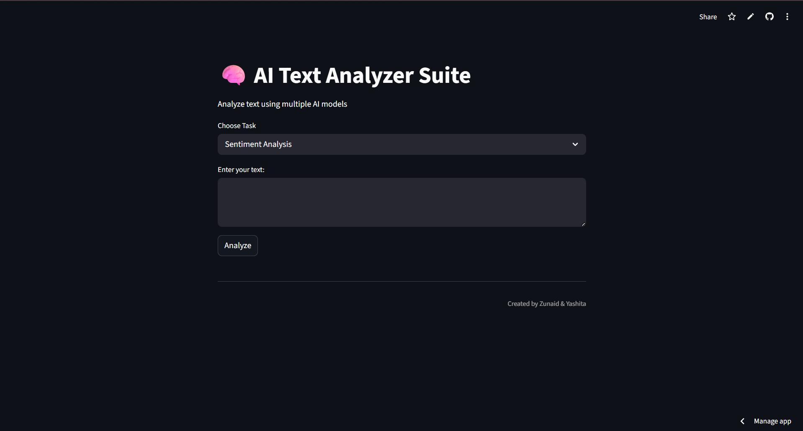
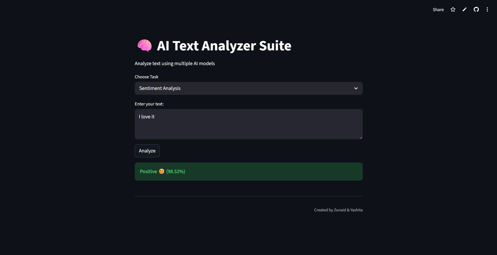

# AI Text Analyzer Suite

A web-based application that performs text analysis using machine learning techniques. The system integrates multiple natural language processing (NLP) models to classify user input into sentiment, spam, and emotion categories.

---

## Overview

The AI Text Analyzer Suite is designed to process textual input and provide real-time predictions using trained machine learning models. The application is deployed as a web interface using Streamlit, allowing users to interact with the models easily.

---

## Features

* Sentiment Analysis (Positive / Negative)
* Spam Detection (Spam / Not Spam)
* Emotion Detection (Sadness, Joy, Love, Anger, Fear, Surprise)
* Real-time prediction
* Web-based user interface

---

## Technologies Used

* Python
* Pandas
* Scikit-learn
* Streamlit
* Pickle
* Regular Expressions (re)

---

## Methodology

1. Text input is collected from the user.
2. Preprocessing is performed:

   * Conversion to lowercase
   * Removal of URLs and special characters
3. Text is transformed into numerical features using TF-IDF vectorization.
4. Machine learning models are applied for classification.
5. The predicted result is displayed through the web interface.

---

## Models Used

| Task               | Model Used                      |
| ------------------ | ------------------------------- |
| Sentiment Analysis | Logistic Regression             |
| Spam Detection     | Multinomial Naive Bayes         |
| Emotion Detection  | Multiclass Classification Model |

---

## Project Structure

```bash
ai-text-analyser/
│
├── data/                  # Dataset files
├── models/                # Trained model files (.pkl)
├── train/                 # Model training scripts
│   ├── train_sentiment.py
│   ├── train_spam.py
│   ├── train_emotion.py
│
├── app.py                 # Main Streamlit application
├── requirements.txt
└── README.md
```

---

## Live Application

https://ai-text-analyser-am3zn6vxshrdqxt8nrm5jx.streamlit.app/

---

## Screenshots

### Application Interface


### Example Output


---

## Installation and Usage

To run the project locally:

```bash
git clone https://github.com/ZxNA9D/ai-text-analyser.git
cd ai-text-analyser

pip install -r requirements.txt
streamlit run app.py
```

---

## Limitations

* The model may misclassify complex or sarcastic sentences.
* Performance depends on the quality and distribution of training data.
* Limited contextual understanding due to traditional machine learning models.

---

## Future Enhancements

* Integration of deep learning models (e.g., LSTM, BERT)
* Improved dataset diversity and size
* Enhanced user interface and experience
* Addition of more NLP features

---

## Authors

Zunaid & Yashita

---

## Acknowledgements

* Kaggle (for datasets)
* Scikit-learn documentation
* Streamlit documentation
